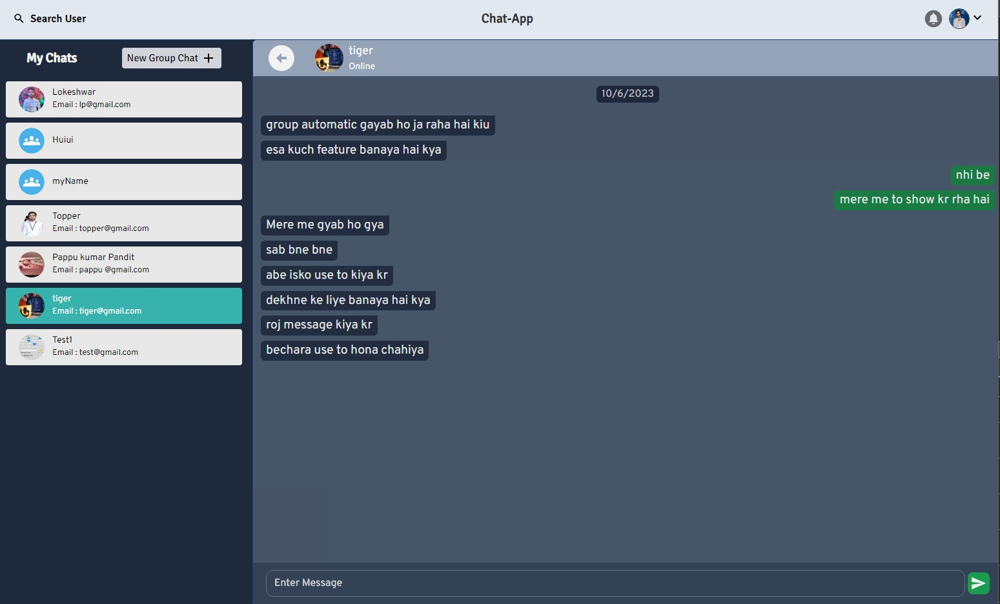

# My Chat App

Welcome to My Chat App, a modernized real-time chat application that enhances communication with friends and groups. Users can create accounts securely, manage profiles with profile pictures, engage in real-time conversations with typing indicators and notifications, and seamlessly navigate through various features.

- [Technologies Used](#technologies-used)
- [Features](#features)
  - [User Account Management](#user-account-management)
  - [Real-Time Chat](#real-time-chat)
  - [Individual and Group Chats](#individual-and-group-chats)
  - [Admin Features](#admin-features)
- [Login Test Credentials](#login-test-credentials)
- [Home Page Screenshot](#home-page-screenshot)
- [Live Demo](#live-demo)
- [Getting Started](#getting-started)
- [Requirements](#requirements)
- [Contributing](#contributing)

## Technologies Used


## Features

### User Account Management

- Users can create accounts securely.
- User authentication and authorization.
- User profiles with profile pictures.

### Real-Time Chat

- Real-time messaging with friends.
- Typing indicators for live conversations.
- Notification alerts for new messages in the navbar.
- Seamless navigation to chat conversations.

### Individual and Group Chats

- Users can engage in one-on-one chat conversations.
- Group chat feature for multiple users to communicate together.
- Users can search for other users by name or email.

### Admin Features

- Admin can remove other users from group chats.
- Group name customization.
- Ability to add new members to group chats.
- User search by name or email.

## Login Test Credentials

Use the following credentials to test the login functionality of My Chat App:

### 1st User :

Email :
`user@gmail.com`
Password :
`12345`

### 2nd User :

Email :
`test@gmail.com`
Password :
`12345`

## Home Page Screenshot



## Live Demo

Check out the live demo of this project [https://lokeshwar-chat-app.onrender.com](https://lokeshwar-chat-app.onrender.com/).

## Getting Started

To run the My Chat App locally, follow these steps:

1. Clone the repository:

   ```sh
   git clone https://github.com/your-username/my-chat-app.git
   ```

2. Navigate to the backend folder:

   ```
   cd backend
   ```

   install dependencies and start the Node.js backend Server :

   ```
       npm install
   ```

   ```
       npm run start
   ```

3. Open new terminal widnow navigate to frontend folder:

   ```
       cd frontend
   ```

   install dependencies and start the Frontend :

   ```
       npm install
   ```

   ```
       npm run start
   ```

4. Access the application in your web browser at
   ```
   http://localhost:3000
   ```

## Requirements

Before running My Chat App locally, ensure Node.js is installed on your system. If Node.js is not installed, you can download it from [nodejs.org](https://nodejs.org/).

## Contributing

Contributions are welcome! Here are a few guidelines to get you started:

- Fork the repository and clone it locally.
- Create a new branch for your feature or bug fix.
- Make your changes and test thoroughly.
- Commit your changes with descriptive commit messages.
- Push your branch to your fork and submit a pull request.

Your feedback and contributions are highly appreciated. If you find this repository useful, please consider leaving a star ⭐.

Thank you for using My Chat App! HAPPY CHATTING! 🚀
